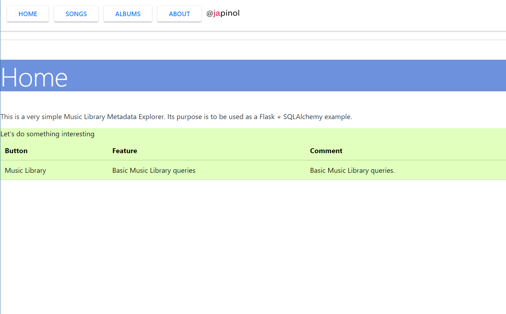
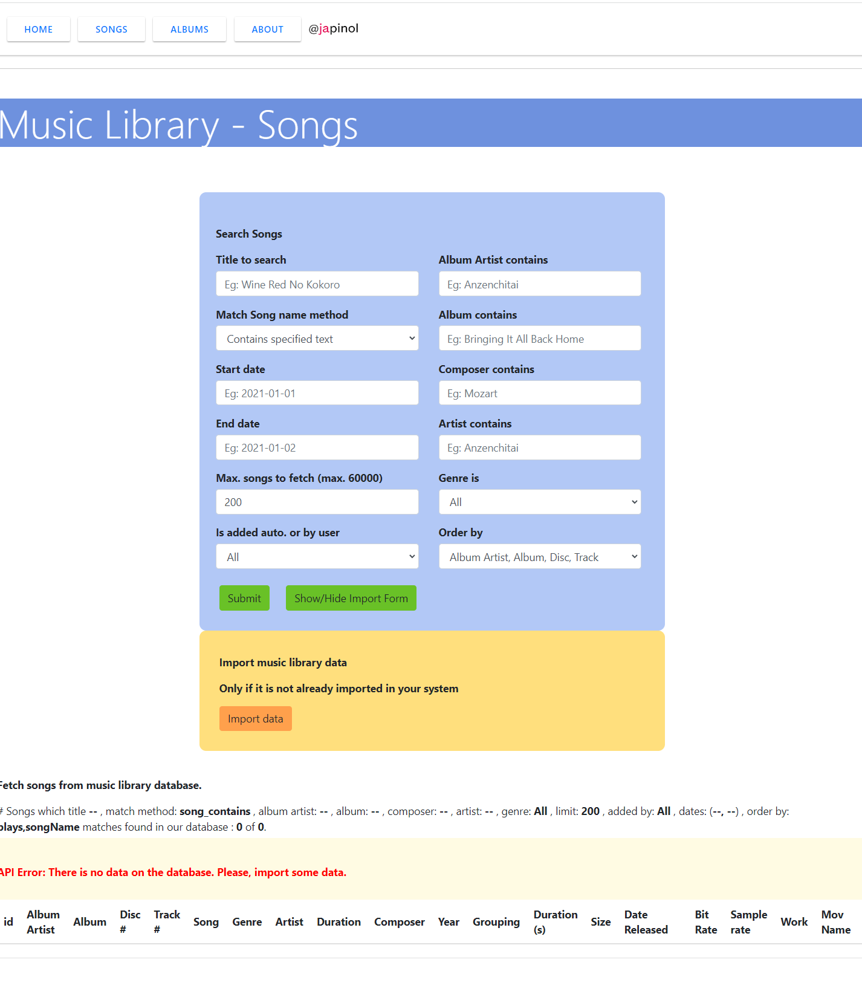
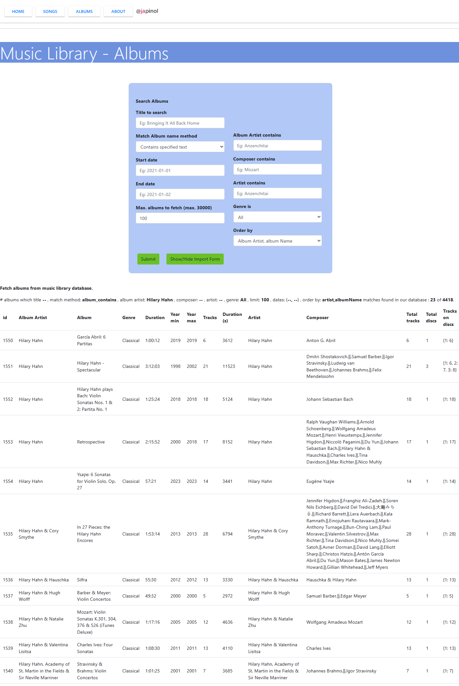

## Music Library Metadata Explorer
This is a very simple Music Library Metadata Explorer.
Its purpose is to be used as a Flask + SQLAlchemy example. 

	Objective: Make a very simple Music Library Metadata Explorer using flask and SQLAlchemy.
    Title: Music Library Metadata Explorer
	program: music-lib-explorer
	version: 1.0.1
	author: Joan A. Pinol
	author_nickname: japinol
	author_gitHub: japinol7
	author_twitter: @japinol
	Python requires: 3.10 or greater.

## Screenshots

    
    
    
  

**To make this web server app to work in your local environment**

	Do this:
	    1. Clone this repository in your local system.
	    2. Go to its folder in your system.
	    3. $ pip install -r requirements.txt
	    4. $ flask run
	    5. Open the website indicated in the console in your browser.
	       Example: http://127.0.0.1:5000/
	    6. To have some demo data, the first time you must import the music data into the database:
	       6. 1. Press the [Songs] button
	       6. 2. Press the [Show/Hide Import Form] button
	       6. 3. Press the [Import data] button
	       6. 4. Note: Once the music data is loaded into the database, you do not have to import it again.
