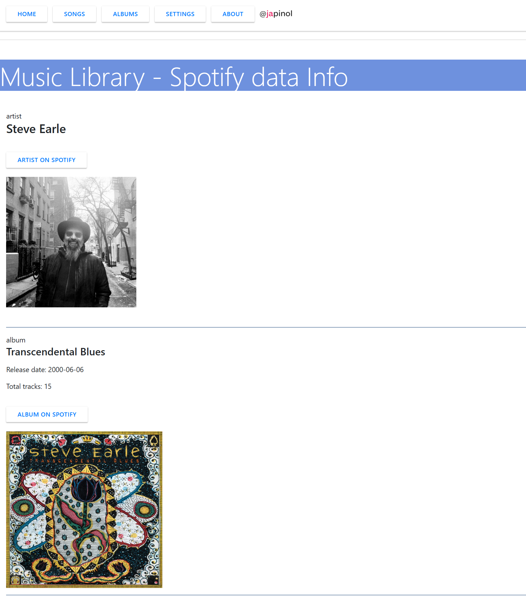

## Music Library Metadata Explorer
This is a very simple Music Library Metadata Explorer.
Its purpose is to be used as a Flask + SQLAlchemy example. 

About the demo data: All the MusicLME demo metadata has been entered  
manually over the years as a hobby by the author of MusicLME. 

Starting with version 1.0.3, MusicLME includes a Spotify integration with   
the Spotify REST API that the user can use to get movie data from Spotify.
* Regarding the Spotify integration:
  * This product uses the Spotify API but is not endorsed or certified by Spotify
  * You will need to get a Spotify API access token to use this integration:  
    https://developer.spotify.com/documentation/
   

### The program 

	Objective: Make a very simple Music Library Metadata Explorer using flask and SQLAlchemy.
    Title: Music Library Metadata Explorer
	program: music-lib-explorer
	version: 1.0.8
	author: Joan A. Pinol
	author_nickname: japinol
	author_gitHub: japinol7
	author_twitter: @japinol
	Python requires: 3.13 or greater.

## Screenshots

    
    
    
    
    

#### Starting with version 1.0.2 you can export the Music data to Excel

#### Starting with version 1.0.3 you can activate the Spotify integration

When activated, a "Spotify" button will appear in the song and album lists.  
This button will open a view with some information about the album and the artist  
and links to the album and the artist on Spotify.

    
    
    
    
    
    
 

**To make this web server app to work in your local environment**

	Do this:
	    1. Clone this repository in your local system.
	    2. Go to its folder in your system.
	    3. $ pip install -r requirements.txt
	    4. $ flask run
	    5. Open the website indicated in the console in your browser.
	       Example: http://127.0.0.1:5000/
	    6. To have some demo data, the first time 
	       you must import the music data into the database:
	       6. 1. Press the [Songs] button
	       6. 2. Press the [Show/Hide Import Form] button
	       6. 3. Press the [Import data] button
	       6. 4. Note: Once the music data is loaded into the database,
	             you do not have to import it again.
 